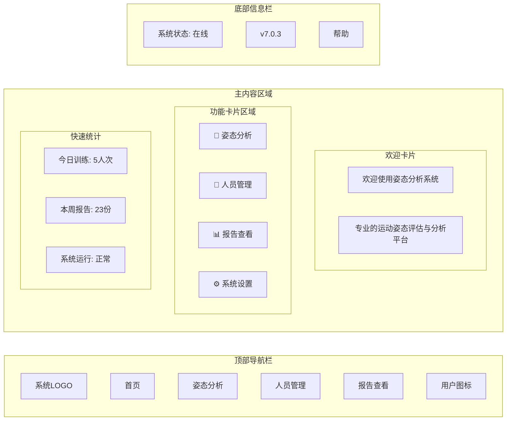
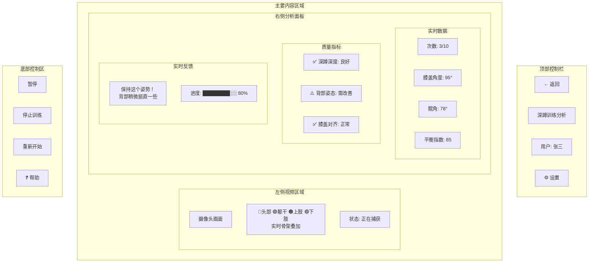
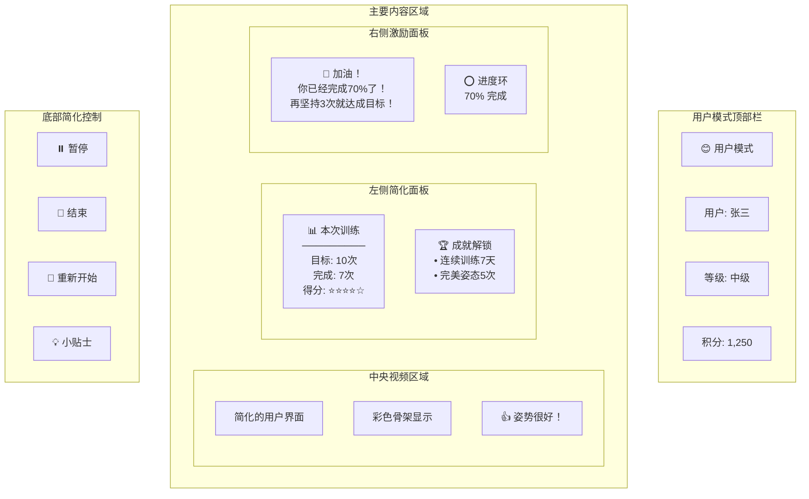
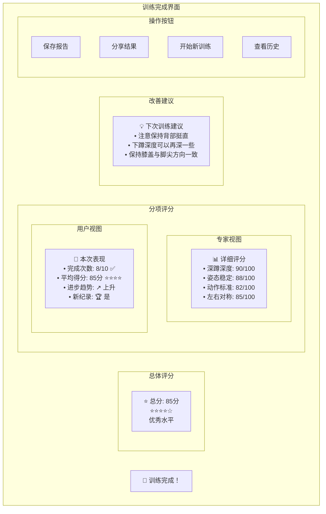
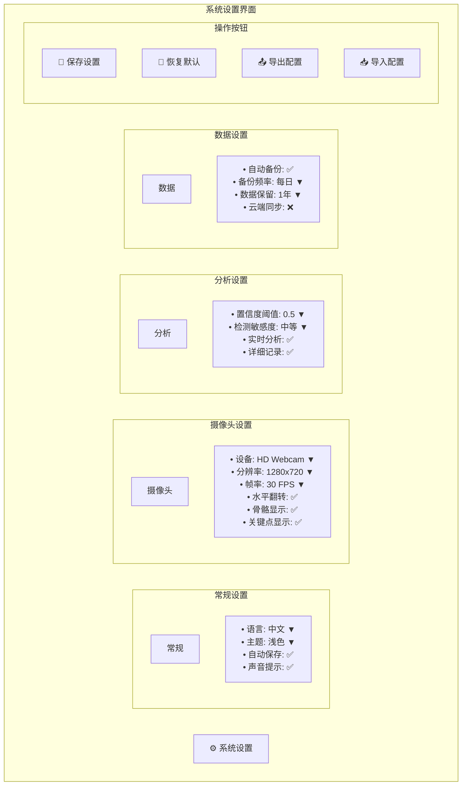
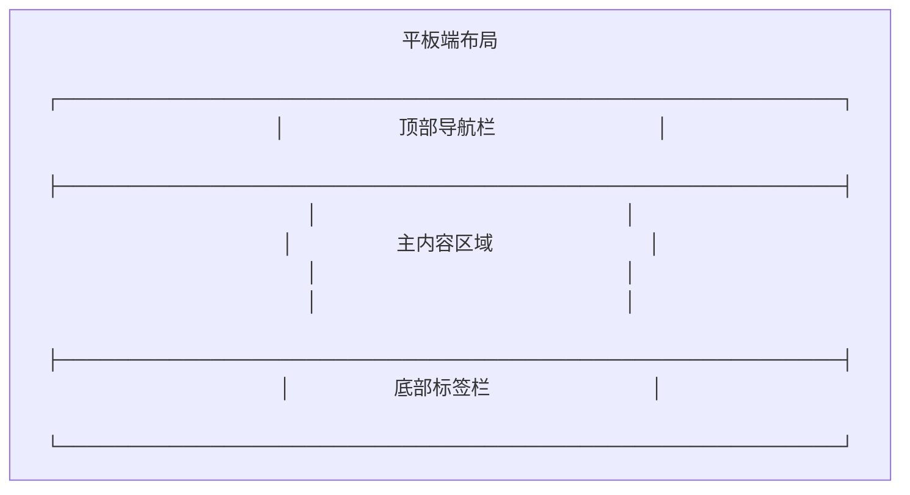
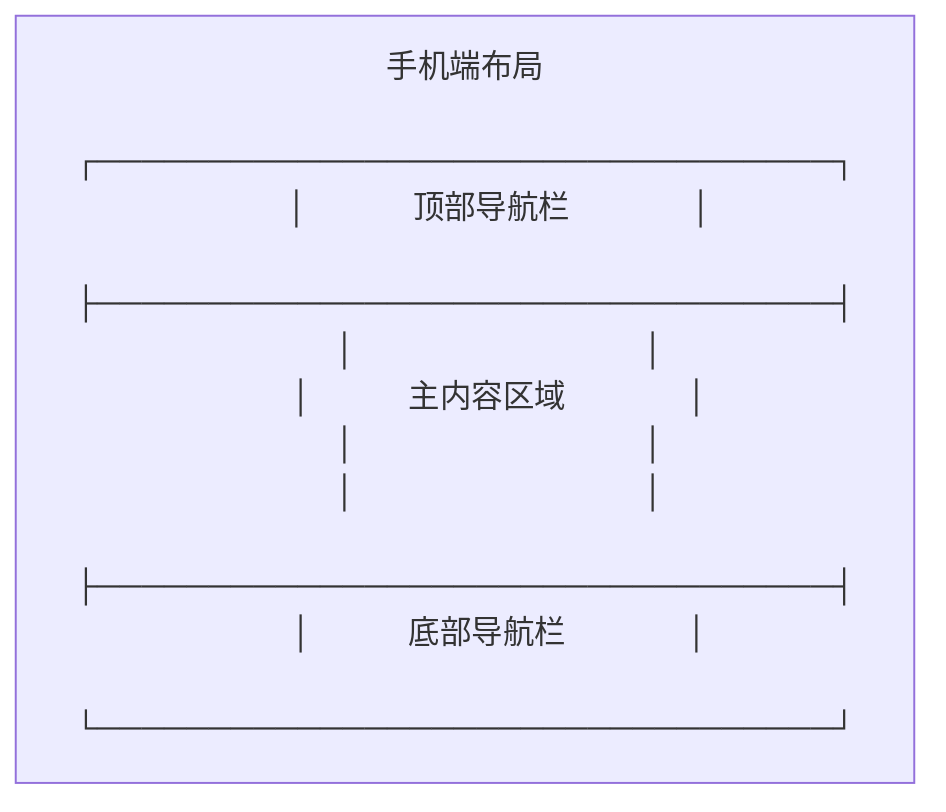
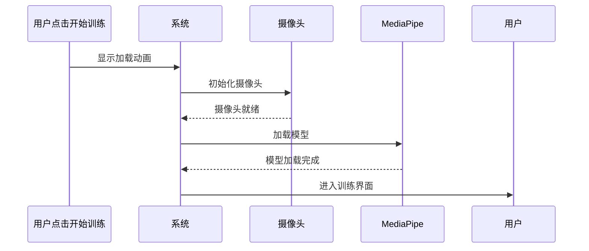

# 姿态分析系统 GUI 交互界面设计图

## 主界面布局设计

### 1. 首页界面 (HomePage)



### 2. 人员选择界面 (SquatSetup)

```mermaid
graph TD
    subgraph "用户选择弹窗"
        ModalHeader[选择用户]
        ModalSubtitle[请选择要进行深蹲训练的用户]

        subgraph "当前用户信息"
            CurrentUser[当前用户: 张三]
            ChangeUser[更换用户]
        end

        subgraph "用户列表"
            User1[张三<br/>25岁 | 男 | 175cm | 70kg →]
            User2[李四<br/>30岁 | 女 | 165cm | 55kg →]
            User3[王五<br/>28岁 | 男 | 180cm | 75kg →]
        end

        subgraph "操作按钮"
            Cancel[取消]
            AddUser[添加新用户]
        end
    end

    subgraph "训练设置区域"
        subgraph "设置卡片"
            SetupTitle[标准深蹲挑战]
            SetupDesc[设定你的训练目标，开始挑战吧！]

            TargetSetting[目标次数]
            CounterControl[<kbd>-</kbd> <kbd>10</kbd> <kbd>+</kbd>]

            StartButton[开始训练]
        end
    end
```

### 3. 训练界面布局 (ExerciseAnalysisPage)



### 4. 专家模式界面

```mermaid
graph TB
    subgraph "专家模式顶部栏"
        ExpertBadge[🎓 专家模式]
        PatientID[用户ID: #0042]
        SessionID[会话: 20241215_001]
        Timestamp[2024-12-15 14:30:25]
    end

    subgraph "四象限布局"
        subgraph "左上: 视频分析"
            ExpertVideo[高精度视频流]
            ExpertSkeleton[专家级骨架分析]
            ConfidenceScore[置信度: 0.95]
        end

        subgraph "右上: 详细数据"
            AngleTable[
                | 关节 | 左侧 | 右侧 | 差值 |
                |---|---|---|---|
                | 膝关节 | 95° | 93° | 2° |
                | 髋关节 | 78° | 80° | 2° |
                | 肩膀 | 175° | 173° | 2° |
            ]
            BalanceChart[平衡指数雷达图]
        end

        subgraph "左下: 历史对比"
            HistoryChart[
                📈 历史趋势图
                最近10次训练对比
            ]
            ComparisonTable[
                | 指标 | 当前 | 平均 | 最佳 |
                |---|---|---|---|
                | 深蹲深度 | 95° | 92° | 98° |
                | 对称性 | 95% | 88% | 97% |
            ]
        end

        subgraph "右下: 专家工具"
            ParameterPanel[
                🔧 参数调整
                • 角度阈值: 90±10°
                • 置信度: ≥0.5
                • 敏感度: 高
            ]
            ExpertActions[
                📋 专家操作
                • [导出数据]
                • [生成报告]
                • [对比分析]
                • [调整标准]
            ]
        end
    end

    subgraph "底部状态栏"
        RealTimeMetrics[
            FPS: 30 | 延迟: 45ms |
            数据包: 1,245 |
            存储状态: 正常
        ]
    end
```

### 5. 用户模式界面



### 6. 质量检查界面

```mermaid
graph TD
    subgraph "质量检查弹窗"
        QCHeader[🔍 姿态质量检查]

        subgraph "检查项目列表"
            QC1[✅ 摄像头状态: 正常]
            QC2[✅ 光线条件: 良好]
            QC3[⚠️ 关键点检测: 部分遮挡]
            QC4[❌ 置信度: 0.42 (低于0.5)]
            QC5[✅ 姿态完整性: 85%]
        end

        subgraph "问题诊断"
            ProblemTitle[📋 检测到的问题]
            ProblemList[
                • 左臂关键点置信度较低
                • 可能存在手臂遮挡
                • 建议调整拍摄角度
            ]
        end

        subgraph "改进建议"
            SuggestionTitle[💡 改进建议]
            SuggestionSteps[
                1. 确保双臂完全可见
                2. 避免身体侧面遮挡
                3. 保持适当距离(2-3米)
                4. 改善室内光线条件
            ]
        end

        subgraph "操作按钮"
            RetryCheck[重新检查]
            IgnoreIssue[忽略并继续]
            GetHelp[需要帮助]
        end
    end
```

### 7. 结果展示界面



### 8. 报告查看界面

```mermaid
graph TB
    subgraph "报告列表界面"
        ReportHeader[📊 训练报告]

        subgraph "筛选条件"
            FilterUser[用户: 张三 ▼]
            FilterDate[日期: 最近30天 ▼]
            FilterType[类型: 深蹲训练 ▼]
            Search[🔍 搜索报告]
        end

        subgraph "报告列表"
            Report1[
                📄 2024-12-15 深蹲训练 #1
                用户: 张三 | 得分: 85分 | 详情→
            ]
            Report2[
                📄 2024-12-14 深蹲训练 #2
                用户: 张三 | 得分: 78分 | 详情→
            ]
            Report3[
                📄 2024-12-13 二头弯举 #1
                用户: 张三 | 得分: 92分 | 详情→
            ]
        end

        subgraph "统计概览"
            Stats[
                📈 本月统计
                • 总训练: 15次
                • 平均得分: 83分
                • 进步趋势: ↗️ +5%
            ]
        end
    end

    subgraph "报告详情界面"
        DetailHeader[
            📄 训练报告详情
            2024-12-15 深蹲训练
        ]

        subgraph "左侧详情"
            BasicInfo[
                ℹ️ 基本信息
                • 用户: 张三 (ID: 0042)
                • 训练时间: 14:30-14:35
                • 目标次数: 10次
                • 完成次数: 8次
                • 成功率: 80%
            ]

            ScoreBreakdown[
                📊 评分明细
                • 深蹲深度: 90/100
                • 姿态稳定: 88/100
                • 动作标准: 82/100
                • 左右对称: 85/100
            ]
        end

        subgraph "右侧图表"
            ProgressChart[
                📈 进步趋势图
                显示最近10次训练变化
            ]
            AngleChart[
                📐 角度分析图
                膝关节角度变化曲线
            ]
        end

        subgraph "底部操作"
            ExportPDF[📄 导出PDF]
            ExportData[💾 导出数据]
            PrintReport[🖨️ 打印报告]
            ShareReport[🔗 分享报告]
        end
    end
```

### 9. 设置界面



## 响应式设计适配

### 桌面端 (1920x1080)
```mermaid
graph LR
    DesktopLayout[
        桌面端布局
        ┌─────────────────────────────────────────────────────────┐
        │                     顶部导航栏                              │
        ├─────────────────────────────────────────────────────────┤
        │ 侧边栏   │                主内容区域                      │
        │ (200px)  │               (1720px)                        │
        ├─────────────────────────────────────────────────────────┤
        │                     底部状态栏                              │
        └─────────────────────────────────────────────────────────┘
    ]
```

### 平板端 (768x1024)


### 手机端 (375x812)


## 交互动效设计

### 加载动画


### 反馈动画
- **成功反馈**: 绿色对勾动画 + 震动反馈
- **警告提示**: 黄色闪烁 + 声音提示
- **错误提示**: 红色警告图标 + 错误详情弹窗
- **进度动画**: 平滑的进度条填充 + 百分比显示

### 状态转换
- **待机→训练**: 淡入效果 + 计时器启动
- **训练→暂停**: 界面冻结 + 暂停图标出现
- **暂停→继续**: 界面解冻 + 计时器继续
- **训练→完成**: 庆祝动画 + 成绩展示

这个GUI设计展示了完整的用户交互界面，从首页到训练、从设置到报告查看的全流程界面布局，确保用户能够清晰直观地使用系统的各项功能。