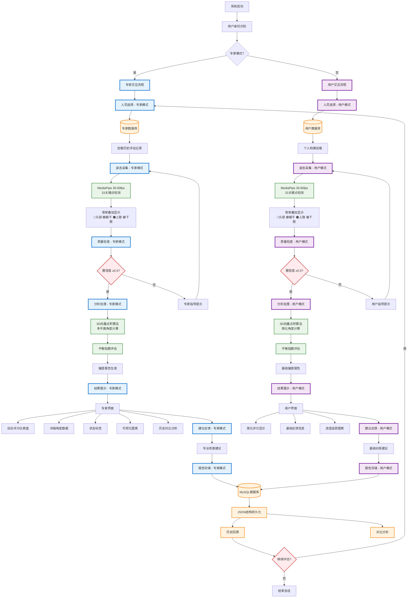
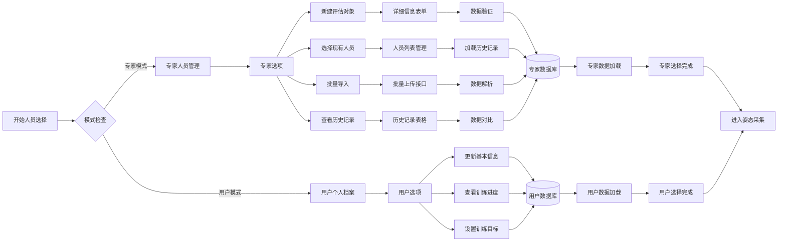
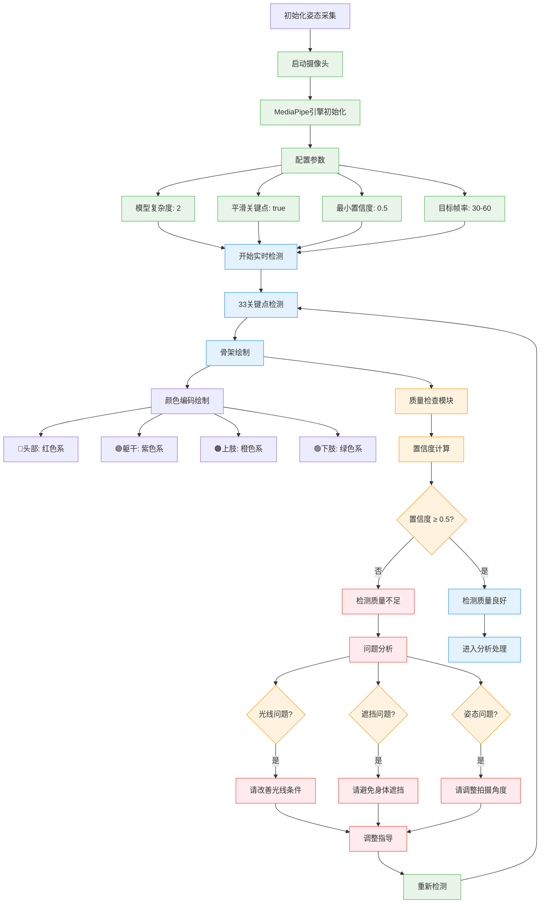
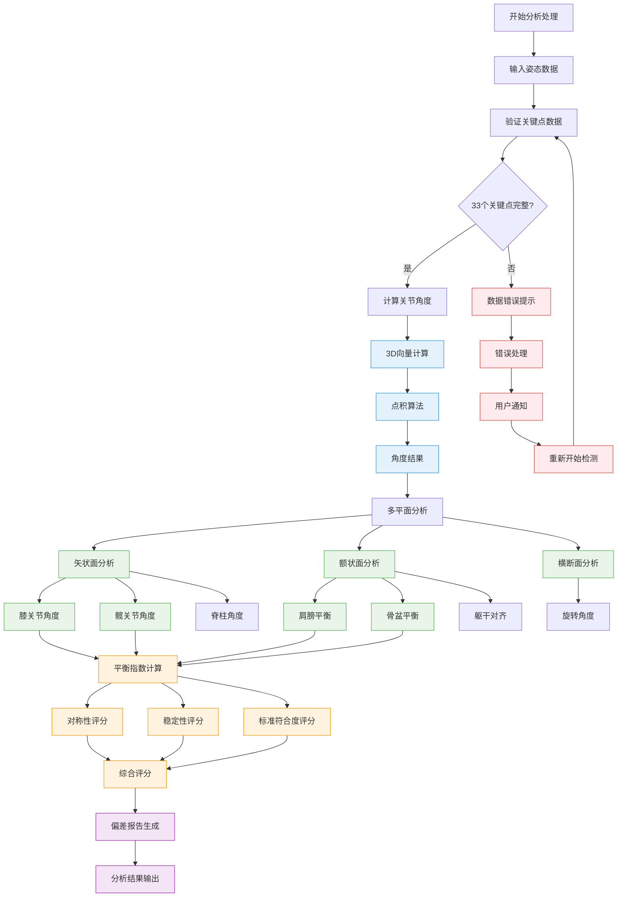
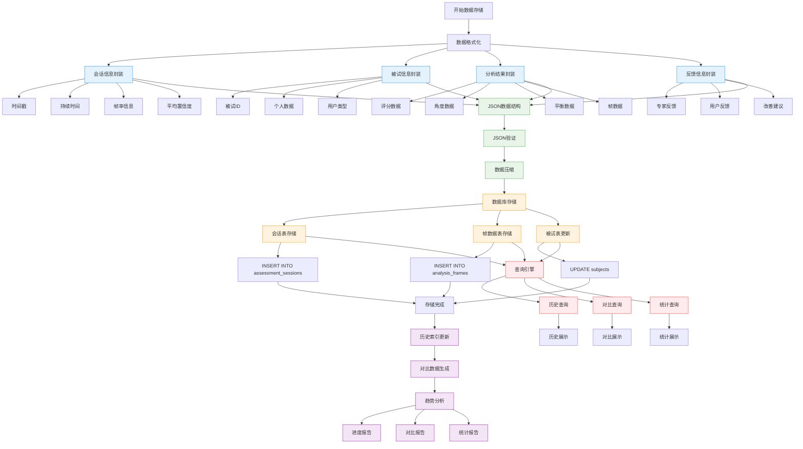
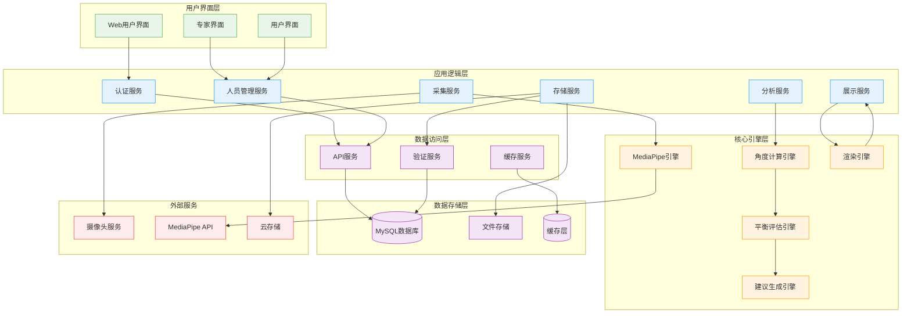

# 姿态分析系统 7.0.3 交互流程图

## 主要交互流程图

## 详细子流程图

### 1. 人员选择子流程

### 2. 姿态采集与质量检查子流程

### 3. 分析处理引擎子流程

### 4. 结果展示与反馈子流程

```mermaid
graph TD
    StartDisplay[开始结果展示] --> ModeSelect{显示模式选择}

    ModeSelect -->|专家模式| ExpertDisplayPanel[专家显示面板]
    ModeSelect -->|用户模式| UserDisplayPanel[用户显示面板]

    %% 专家显示面板
    ExpertDisplayPanel --> ScoreDashboard[评分仪表盘]
    ScoreDashboard --> OverallGauge[总分仪表]
    ScoreDashboard --> CategoryScores[分项评分]

    ExpertDisplayPanel --> AngleDetails[角度详情面板]
    AngleDetails --> SagittalAngles[矢状面角度数据]
    AngleDetails --> CoronalAngles[额状面角度数据]
    AngleDetails --> AngleCharts[角度变化图表]

    ExpertDisplayPanel --> StatusPanel[状态标签面板]
    StatusPanel --> QualityStatus[质量状态标签]
    StatusPanel --> DeviationTags[偏差标记]
    StatusPanel --> ImprovementMarkers[改善标记]

    ExpertDisplayPanel --> VisualPanel[可视化面板]
    VisualPanel --> SkeletonHeatmap[骨架热力图]
    VisualPanel --> TrajectoryChart[运动轨迹图]
    VisualPanel --> ComparisonChart[历史对比图]

    ExpertDisplayPanel --> ExpertTools[专家工具]
    ExpertTools --> ParameterAdjust[参数调整]
    ExpertTools --> DataExport[数据导出]
    ExpertTools --> ReportTemplate[报告模板]

    %% 用户显示面板
    UserDisplayPanel --> SimpleScore[简化评分显示]
    SimpleScore --> StarRating[星级评分]
    SimpleScore --> ProgressArc[进度弧线]
    SimpleScore --> AchievementBadge[成就徽章]

    UserDisplayPanel --> BasicFeedback[基础反馈信息]
    BasicFeedback --> MainIssues[主要问题]
    BasicFeedback --> ProgressTips[进步提示]
    BasicFeedback --> EncouragementMsg[鼓励消息]

    UserDisplayPanel --> ProgressPanel[进度面板]
    ProgressPanel --> HistoryProgress[历史进度]
    ProgressPanel --> TrendChart[趋势图表]
    ProgressPanel --> GoalTracking[目标跟踪]

    %% 建议反馈生成
    ExpertTools --> SuggestionEngine[建议生成引擎]
    ProgressPanel --> SuggestionEngine

    SuggestionEngine --> ExpertSuggestions[专家建议系统]
    SuggestionEngine --> UserSuggestions[用户建议系统]

    ExpertSuggestions --> ProfessionalAdvice[专业改善方案]
    ExpertSuggestions --> TechnicalAnalysis[技术分析报告]
    ExpertSuggestions --> TrainingPlan[训练计划制定]

    UserSuggestions --> SimpleAdvice[简单指导建议]
    UserSuggestions --> MotivationTips[激励提示]
    UserSuggestions --> NextSteps[下一步行动]

    ProfessionalAdvice --> FeedbackDisplay[反馈显示]
    TechnicalAnalysis --> FeedbackDisplay
    TrainingPlan --> FeedbackDisplay

    SimpleAdvice --> FeedbackDisplay
    MotivationTips --> FeedbackDisplay
    NextSteps --> FeedbackDisplay

    classDef expertPanel fill:#e3f2fd,stroke:#1976d2,stroke-width:2px
    classDef userPanel fill:#f3e5f5,stroke:#7b1fa2,stroke-width:2px
    classDef engine fill:#e8f5e8,stroke:#388e3c,stroke-width:2px
    classDef display fill:#fff3e0,stroke:#f57c00,stroke-width:2px

    class ExpertDisplayPanel,ScoreDashboard,AngleDetails,StatusPanel,VisualPanel,ExpertTools expertPanel
    class UserDisplayPanel,SimpleScore,BasicFeedback,ProgressPanel userPanel
    class SuggestionEngine,ExpertSuggestions,UserSuggestions engine
    class FeedbackDisplay,ProfessionalAdvice,TechnicalAnalysis,TrainingPlan,SimpleAdvice,MotivationTips,NextSteps display
```

### 5. 数据存储与历史管理子流程

## 系统整体架构图

这些详细的流程图完整展示了姿态分析系统7.0.3版本的交互流程，涵盖了从人员选择到数据存储的完整链路，并体现了"专家-系统"与"用户-系统"的双重交互机制。