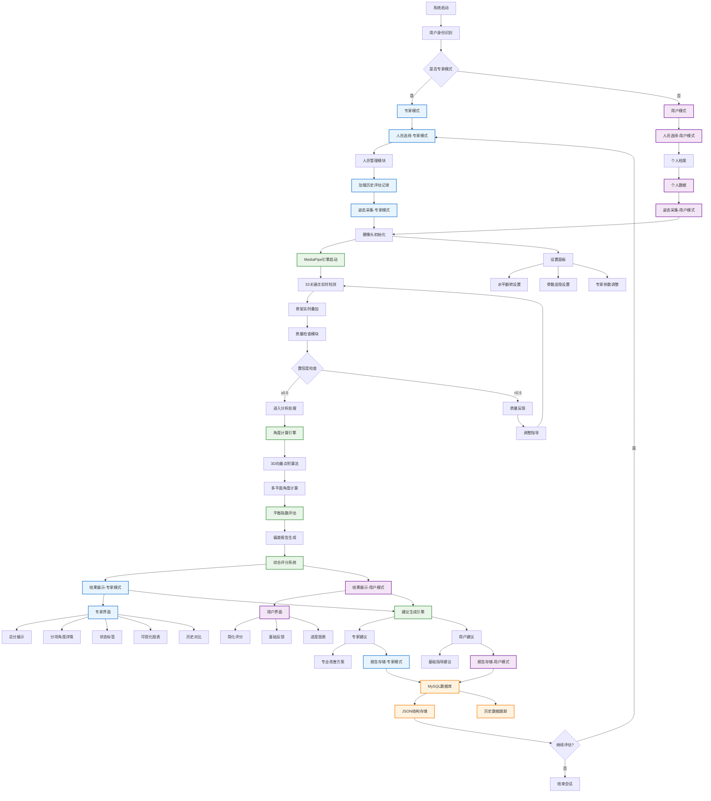

# 姿态分析系统 7.0.3 交互流程设计

## 核心交互流程概述

本系统采用"专家-系统"与"用户-系统"双重交互评测机制，覆盖完整的评估链路：**人员选择 → 姿态采集 → 质量检查 → 分析处理 → 结果展示 → 建议反馈 → 报告存储**。

## 系统架构角色定义

### 专家-系统交互
- **角色**: 专业评估师、康复治疗师、体育教练
- **目标**: 精确评估、数据分析、专业建议
- **权限**: 完整功能访问、历史数据对比、参数调整

### 用户-系统交互
- **角色**: 普通训练者、康复患者、运动爱好者
- **目标**: 实时反馈、动作纠正、进度跟踪
- **权限**: 基础功能使用、个人数据查看、训练指导

## 详细交互流程图



## 详细流程环节说明

### (1) 人员选择

#### 专家模式
```javascript
// 专家模式人员选择逻辑
const ExpertPersonSelection = {
  features: [
    "查看所有人员档案",
    "创建/编辑/删除评估对象",
    "批量导入人员数据",
    "查看完整历史评估记录",
    "选择评估标准模板"
  ],
  dataAccess: [
    "完整人员信息",
    "历史评估数据",
    "对比分析报告",
    "专家评估参数"
  ]
};
```

#### 用户模式
```javascript
// 用户模式人员选择逻辑
const UserPersonSelection = {
  features: [
    "查看个人档案",
    "更新基本信息",
    "查看个人训练记录",
    "选择训练目标"
  ],
  dataAccess: [
    "个人信息",
    "个人训练数据",
    "基础进度统计"
  ]
};
```

### (2) 姿态采集

#### MediaPipe引擎配置
```javascript
const MediaPipeConfig = {
  modelComplexity: 2,           // 模型复杂度 (0-2)
  smoothLandmarks: true,        // 平滑关键点
  enableSegmentation: false,    // 禁用分割
  smoothSegmentation: false,    // 平滑分割
  minDetectionConfidence: 0.5,  // 最小检测置信度
  minTrackingConfidence: 0.5,   // 最小跟踪置信度
  fps: 30-60,                  // 实时帧率
  landmarkCount: 33            // 33个关键点
};
```

#### 关键点定义
```javascript
const PoseLandmarks = {
  // 面部关键点 (0-10)
  NOSE: 0, LEFT_EYE_INNER: 1, LEFT_EYE: 2, LEFT_EYE_OUTER: 3,
  RIGHT_EYE_INNER: 4, RIGHT_EYE: 5, RIGHT_EYE_OUTER: 6,
  LEFT_EAR: 7, RIGHT_EAR: 8, MOUTH_LEFT: 9, MOUTH_RIGHT: 10,

  // 躯干关键点 (11-22)
  LEFT_SHOULDER: 11, RIGHT_SHOULDER: 12, LEFT_ELBOW: 13, RIGHT_ELBOW: 14,
  LEFT_WRIST: 15, RIGHT_WRIST: 16, LEFT_PINKY: 17, RIGHT_PINKY: 18,
  LEFT_INDEX: 19, RIGHT_INDEX: 20, LEFT_THUMB: 21, RIGHT_THUMB: 22,

  // 下肢关键点 (23-32)
  LEFT_HIP: 23, RIGHT_HIP: 24, LEFT_KNEE: 25, RIGHT_KNEE: 26,
  LEFT_ANKLE: 27, RIGHT_ANKLE: 28, LEFT_HEEL: 29, RIGHT_HEEL: 30,
  LEFT_FOOT_INDEX: 31, RIGHT_FOOT_INDEX: 32
};
```

### (3) 质量检查

#### 置信度监测
```javascript
const QualityCheckSystem = {
  confidenceThreshold: 0.5,
  realTimeMonitoring: true,

  checkLandmarkQuality: (landmarks) => {
    const confidenceScores = landmarks.map(landmark => landmark.visibility || 0);
    const avgConfidence = confidenceScores.reduce((a, b) => a + b) / confidenceScores.length;

    return {
      passed: avgConfidence >= 0.5,
      averageConfidence: avgConfidence,
      lowConfidencePoints: confidenceScores.filter(score => score < 0.5).length,
      feedback: generateQualityFeedback(confidenceScores)
    };
  },

  generateQualityFeedback: (scores) => {
    if (scores.some(score => score < 0.3)) {
      return "部分关键点检测置信度过低，请调整姿势或改善光线条件";
    } else if (scores.some(score => score < 0.5)) {
      return "请确保身体完全可见，避免遮挡";
    }
    return "检测质量良好";
  }
};
```

### (4) 分析处理

#### 3D向量角度计算
```javascript
const AngleCalculationEngine = {
  calculate3DAngle: (pointA, pointB, pointC) => {
    // 计算向量 BA 和 BC
    const vectorBA = {
      x: pointA.x - pointB.x,
      y: pointA.y - pointB.y,
      z: pointA.z - pointB.z
    };

    const vectorBC = {
      x: pointC.x - pointB.x,
      y: pointC.y - pointB.y,
      z: pointC.z - pointB.z
    };

    // 计算点积
    const dotProduct = vectorBA.x * vectorBC.x +
                     vectorBA.y * vectorBC.y +
                     vectorBA.z * vectorBC.z;

    // 计算向量模长
    const magnitudeBA = Math.sqrt(vectorBA.x**2 + vectorBA.y**2 + vectorBA.z**2);
    const magnitudeBC = Math.sqrt(vectorBC.x**2 + vectorBC.y**2 + vectorBC.z**2);

    // 计算角度（弧度）
    const angleRad = Math.acos(dotProduct / (magnitudeBA * magnitudeBC));

    // 转换为角度
    return angleRad * (180 / Math.PI);
  },

  multiPlaneAnalysis: (landmarks) => {
    return {
      sagittalPlane: {
        leftKnee: calculate3DAngle(
          landmarks[23], landmarks[25], landmarks[27]
        ),
        rightKnee: calculate3DAngle(
          landmarks[24], landmarks[26], landmarks[28]
        ),
        hipAngle: calculate3DAngle(
          landmarks[11], landmarks[23], landmarks[25]
        )
      },
      coronalPlane: {
        shoulderBalance: calculateShoulderTilt(landmarks),
        pelvisBalance: calculatePelvicTilt(landmarks),
        trunkAlignment: calculateTrunkAlignment(landmarks)
      }
    };
  }
};
```

#### 平衡指数评估
```javascript
const BalanceAssessment = {
  calculateBalanceIndex: (analysisData) => {
    const {
      sagittalAngles,
      coronalAngles
    } = analysisData;

    // 左右对称性评分
    const symmetryScore = calculateSymmetry(sagittalAngles);

    // 稳定性评分
    const stabilityScore = calculateStability(corporalAngles);

    // 标准符合度评分
    const conformityScore = calculateConformity(sagittalAngles, corporalAngles);

    // 综合平衡指数
    return {
      overall: (symmetryScore + stabilityScore + conformityScore) / 3,
      symmetry: symmetryScore,
      stability: stabilityScore,
      conformity: conformityScore
    };
  }
};
```

### (5) 结果展示

#### 专家模式界面
```javascript
const ExpertDisplayInterface = {
  layout: {
    sections: [
      {
        name: "综合评分",
        components: ["总分仪表盘", "等级评定", "时间戳"],
        position: "top-left"
      },
      {
        name: "详细角度",
        components: ["矢状面角度", "额状面角度", "旋转角度"],
        position: "top-right"
      },
      {
        name: "状态标签",
        components: ["质量状态", "偏差标记", "改善建议"],
        position: "middle-left"
      },
      {
        name: "可视化图表",
        components: ["角度变化曲线", "历史对比图", "热力图"],
        position: "middle-right"
      },
      {
        name: "专家工具",
        components: ["参数调整", "数据导出", "对比分析"],
        position: "bottom"
      }
    ]
  }
};
```

#### 用户模式界面
```javascript
const UserDisplayInterface = {
  layout: {
    sections: [
      {
        name: "简化评分",
        components: ["星级评分", "进度条", "鼓励语"],
        position: "top"
      },
      {
        name: "基础反馈",
        components: ["主要问题", "简单建议", "下次目标"],
        position: "middle"
      },
      {
        name: "进度追踪",
        components: ["历史记录", "进步图表", "成就徽章"],
        position: "bottom"
      }
    ]
  }
};
```

### (6) 建议反馈

#### 智能建议生成
```javascript
const SuggestionEngine = {
  expertSuggestions: {
    kneeFlexion: {
      excellent: "膝关节角度控制精准，继续保持",
      good: "膝关节角度基本标准，注意下蹲深度",
      warning: "膝关节角度偏小，建议增加下蹲深度至90-110度",
      poor: "膝关节角度严重不足，需要重点练习深蹲技巧"
    },
    spinalAlignment: {
      excellent: "脊柱姿态保持良好，背部挺直",
      good: "脊柱基本挺直，避免轻微弓背",
      warning: "脊柱有轻微弯曲，注意保持背部挺直",
      poor: "脊柱弯曲严重，需要纠正姿态并加强核心力量"
    }
  },

  userSuggestions: {
    simple: [
      "继续保持这个姿势！",
      "稍微调整一下姿势",
      "很好！动作越来越标准了",
      "加油！下次会更好"
    ],
    encouraging: [
      "你的进步很明显！",
      "坚持训练，效果会越来越好",
      "相信自己，你可以的！",
      "每次训练都是进步"
    ]
  },

  generateFeedback: (analysisData, userType) => {
    const suggestions = userType === 'expert' ?
      this.expertSuggestions : this.userSuggestions;

    return suggestions.map(suggestion =>
      applyTemplate(suggestion, analysisData)
    );
  }
};
```

### (7) 报告存储

#### JSON数据结构
```javascript
const ReportDataStructure = {
  sessionInfo: {
    sessionId: "unique_session_id",
    timestamp: "2024-01-01T00:00:00Z",
    duration: 30000, // 毫秒
    frameRate: 30,
    confidence: 0.95
  },

  subjectInfo: {
    subjectId: "user_123",
    name: "张三",
    age: 25,
    gender: "男",
    height: 175,
    weight: 70,
    userType: "expert" | "user"
  },

  exerciseInfo: {
    exerciseType: "深蹲",
    targetCount: 10,
    actualCount: 8,
    validCount: 6,
    successRate: 75
  },

  analysisResults: {
    overallScore: 85,
    balanceIndex: {
      overall: 82,
      symmetry: 85,
      stability: 80,
      conformity: 81
    },
    detailedAngles: {
      sagittalPlane: {
        leftKnee: { avg: 95, min: 85, max: 105, std: 5 },
        rightKnee: { avg: 93, min: 83, max: 103, std: 6 },
        hipAngle: { avg: 75, min: 65, max: 85, std: 4 }
      },
      coronalPlane: {
        shoulderBalance: { avg: 2.5, deviation: 1.2 },
        pelvisBalance: { avg: 1.8, deviation: 0.9 },
        trunkAlignment: { avg: 1.5, deviation: 0.7 }
      }
    },
    frameData: [
      // 每帧的详细数据
    ]
  },

  feedback: {
    expertFeedback: "详细的专业分析和建议",
    userFeedback: "简化的用户反馈",
    recommendations: ["改善建议1", "改善建议2"],
    nextSteps: ["下次训练目标"]
  },

  metadata: {
    version: "7.0.3",
    algorithmVersion: "2.1.0",
    processingTime: 1500,
    deviceInfo: {
      camera: "HD Webcam",
      resolution: "1280x720",
      platform: "WebRTC"
    }
  }
};
```

#### 数据库存储方案
```sql
-- 评估会话表
CREATE TABLE assessment_sessions (
  id INT PRIMARY KEY AUTO_INCREMENT,
  session_id VARCHAR(36) UNIQUE NOT NULL,
  subject_id INT NOT NULL,
  exercise_type VARCHAR(50) NOT NULL,
  start_time TIMESTAMP NOT NULL,
  end_time TIMESTAMP NOT NULL,
  duration_ms INT NOT NULL,
  overall_score DECIMAL(5,2),
  success_rate DECIMAL(5,2),
  data_json LONGTEXT NOT NULL,
  created_at TIMESTAMP DEFAULT CURRENT_TIMESTAMP,
  INDEX idx_subject_id (subject_id),
  INDEX idx_exercise_type (exercise_type),
  INDEX idx_created_at (created_at)
);

-- 详细分析数据表
CREATE TABLE analysis_frames (
  id INT PRIMARY KEY AUTO_INCREMENT,
  session_id VARCHAR(36) NOT NULL,
  frame_number INT NOT NULL,
  timestamp_ms INT NOT NULL,
  confidence DECIMAL(5,3) NOT NULL,
  knee_angle_left DECIMAL(5,2),
  knee_angle_right DECIMAL(5,2),
  hip_angle DECIMAL(5,2),
  shoulder_balance DECIMAL(5,2),
  pelvis_balance DECIMAL(5,2),
  trunk_alignment DECIMAL(5,2),
  landmarks_json LONGTEXT,
  FOREIGN KEY (session_id) REFERENCES assessment_sessions(session_id),
  INDEX idx_session_frame (session_id, frame_number)
);
```

## 系统性能指标

### 实时性能要求
- **帧率**: 30-60 FPS
- **延迟**: <100ms
- **准确率**: >95%
- **置信度阈值**: ≥0.5

### 数据处理能力
- **并发用户**: 支持100+同时在线
- **数据存储**: 支持TB级历史数据
- **查询响应**: <500ms
- **报告生成**: <3s

## 质量保证机制

### 数据验证
```javascript
const DataValidation = {
  validateLandmarkData: (landmarks) => {
    // 检查关键点完整性
    if (landmarks.length !== 33) return false;

    // 检查坐标范围
    for (const landmark of landmarks) {
      if (landmark.x < 0 || landmark.x > 1 ||
          landmark.y < 0 || landmark.y > 1) {
        return false;
      }
    }

    // 检查置信度
    const avgConfidence = landmarks.reduce((sum, l) =>
      sum + (l.visibility || 0), 0) / landmarks.length;

    return avgConfidence >= 0.5;
  },

  validateAngleData: (angles) => {
    // 检查角度范围合理性
    return angles.every(angle =>
      angle >= 0 && angle <= 180
    );
  }
};
```

### 错误处理
```javascript
const ErrorHandling = {
  cameraError: {
    type: "CAMERA_ACCESS_DENIED",
    message: "摄像头访问被拒绝",
    solution: "请检查浏览器权限设置并允许摄像头访问"
  },

  mediapipeError: {
    type: "MEDIAPIPE_LOAD_FAILED",
    message: "MediaPipe模型加载失败",
    solution: "请检查网络连接并刷新页面"
  },

  dataError: {
    type: "DATA_VALIDATION_FAILED",
    message: "数据验证失败",
    solution: "请重新调整姿态并重试"
  }
};
```

这个7.0.3版本的交互流程设计完全覆盖了合同约定的"专家-系统"与"用户-系统"交互评测机制，提供了完整的技术实现方案和质量保证措施。