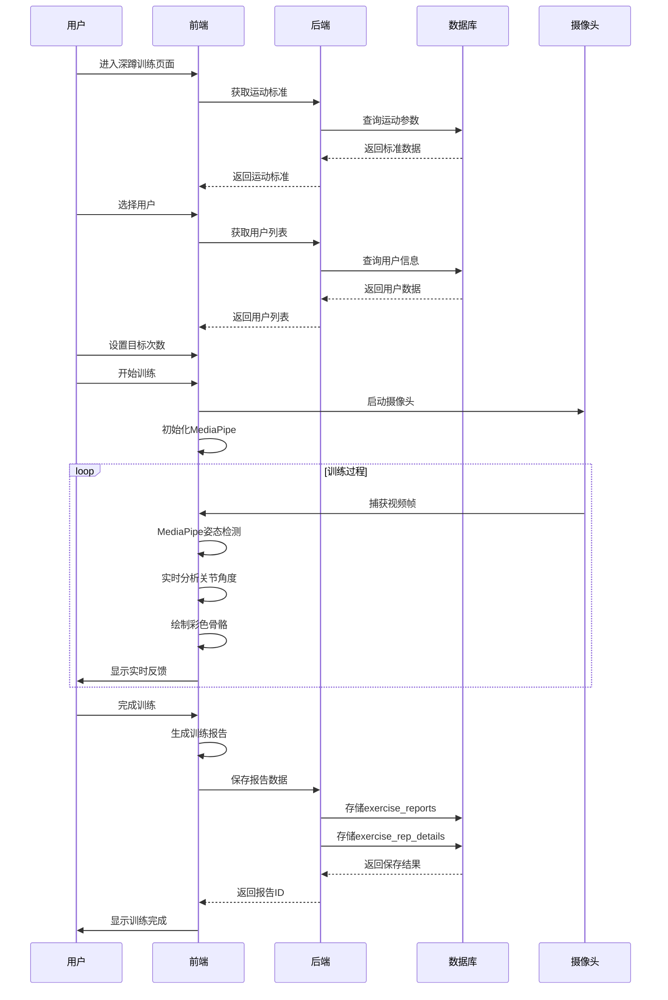

# 姿态分析系统交互流程设计图

## 系统概览
这是一个基于MediaPipe姿态检测的运动训练分析系统，包含深蹲、二头弯举等运动的实时分析和训练报告生成功能。

## 核心交互流程

## 详细组件交互图

## 状态机转换图

## 数据库ER图

## 技术架构图

## 用户操作时序图

## 关键特性说明

### 1. 彩色骨骼绘制系统
- 🔴 **头部连接**: 红色系 (#dc2626, #ef4444)
- 🟣 **躯干连接**: 紫色系 (#9333ea, #a855f7)
- 🟠 **上肢连接**: 橙色系 (#ea580c, #fb923c)
- 🟢 **下肢连接**: 绿色系 (#16a34a, #4ade80)

### 2. 实时姿态分析
- 33个MediaPipe关键点检测
- 实时关节角度计算
- 运动质量实时评分
- 渐变色彩视觉效果

### 3. 智能状态管理
- useReducer状态机控制训练流程
- 会话数据实时追踪
- 错误状态处理和恢复

### 4. 数据持久化
- MySQL数据库存储用户信息
- 训练报告详细记录
- 支持历史数据查询和导出

这个系统提供了完整的运动训练分析解决方案，从用户选择到实时分析，再到报告生成和数据存储的全流程覆盖。